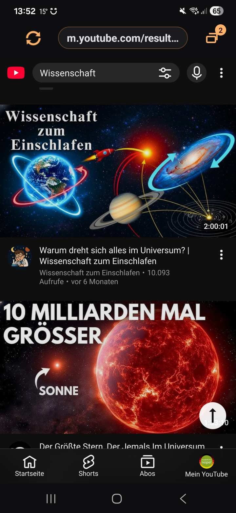
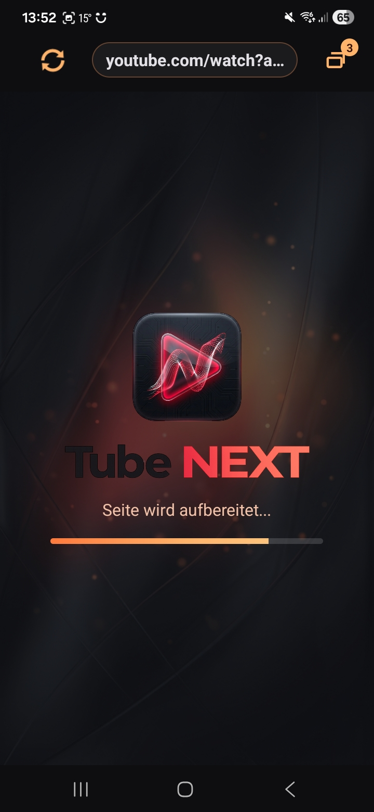
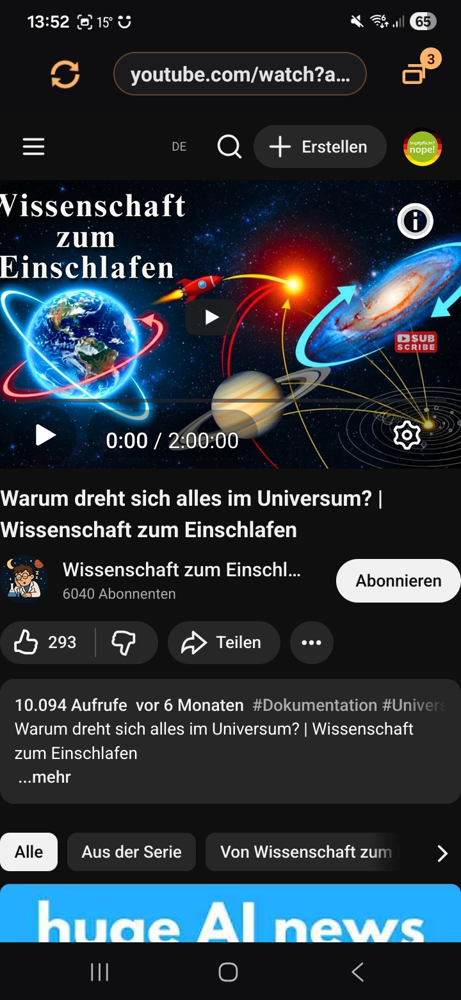
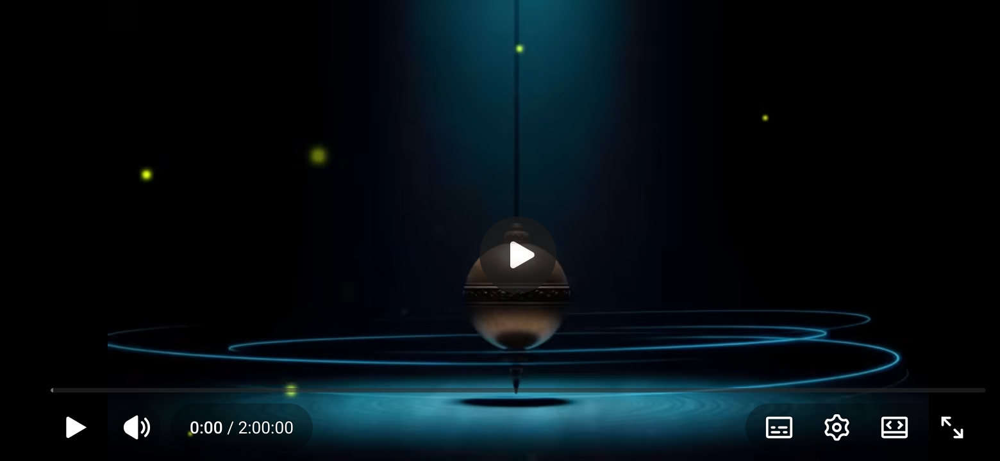
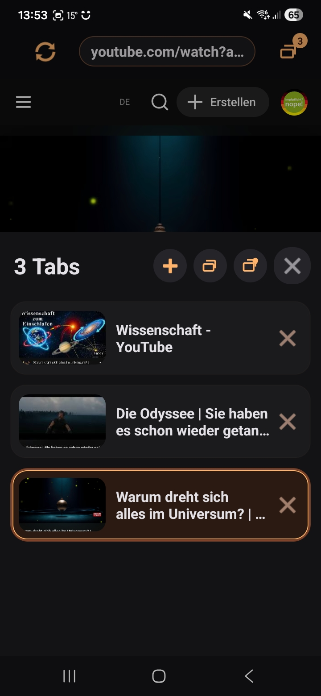

# Tube NEXT

Tube NEXT ist eine Android-App fuer alle, die YouTube lieber wie im Browser nutzen, aber nicht auf eine touchfreundliche App-Oberflaeche verzichten wollen. Die App packt die offizielle YouTube-Webseite in eine eigene GeckoView-basierte Browser-Huelle mit Tabs, dunklem App-Rahmen, Video-Fokus und Hintergrund-Audio.

> Tube NEXT ist ein privates, experimentelles Projekt und steht in keiner Verbindung zu YouTube oder Google. Die App nutzt die offizielle YouTube-Webseite. Sie ist keine eigene Videoplattform, kein Downloader und kein Adblocker.

## Warum gibt es diese App?

Der Ausloeser war ein sehr praktisches Problem: Die offizielle YouTube-App kann auf manchen Geraeten auffaellig energiehungrig sein. Das Handy wird warm, der Akku leert sich schneller, und trotzdem funktioniert YouTube im normalen Browser oft deutlich kuehler und entspannter.

Tube NEXT ist der Versuch, genau diese Browser-Erfahrung in eine alltagstaugliche App zu bringen:

- YouTube bleibt die offizielle Webseite.
- Die App fuehlt sich trotzdem wie eine eigene mobile Anwendung an.
- Videos laufen stabiler im gewuenschten Bedienkontext.
- Hintergrund-Audio und Mediensteuerung sind in Android integriert.
- Fuer Tanztraining, Tutorials und lange Videos gibt es Komfortfunktionen, die normale Browser so nicht anbieten.

## Was macht Tube NEXT besonders?

- **Mobile Oberflaeche fuer normale YouTube-Seiten:** Start, Suche, Kanal- und Uebersichtsseiten bleiben touchfreundlich.
- **Desktop-Watch fuer Video-Seiten:** Watch-Seiten koennen Desktop-Funktionen nutzen, werden aber per CSS/Viewport-Anpassung mobil passend gemacht.
- **Tabs wie im Browser:** Mehrere YouTube-Seiten parallel offen halten,
  wechseln, schliessen und per live aktualisierter Vorschau wiederfinden. Sehr
  schnell verlassene Watch-Tabs erhalten mindestens das offizielle
  Video-Artwork.
- **Zurück und vorwärts pro Tab:** Gut erreichbare Toolbar-Tasten folgen der sichtbaren History des jeweils aktiven Tabs.
- **Linkaktionen per Long-Tap:** Gedrueckt halten und nach links zum Aktionsmenue oder nach rechts zum neuen Tab ziehen; normale kurze Taps bleiben bei YouTube.
- **Hintergrund-Audio:** Audio kann weiterlaufen, wenn die App im Hintergrund ist. Android zeigt dazu eine Medienbenachrichtigung mit Steuerung.
- **Fullscreen bei Querformat:** Dreht man das Telefon, wird die Watch-Ansicht immersiv und zoombar.
- **Pinch-to-Zoom im Video:** Besonders praktisch fuer Tutorials, Tanzvideos oder Detailanalyse.
- **Cue-Modus:** Per Long-Tap im Landscape-Player kann ein Cue-Punkt gesetzt werden. Der Cue-Button springt exakt zu dieser Stelle zurueck.
- **Saubere Links teilen:** Tap auf die Adressleiste kopiert die sichtbare URL, ohne zusaetzliche YouTube-Share-Parameter. Long-Tap auf die Adressleiste oeffnet den URL-Editor.
- **Dunkles, eigenstaendiges Design:** App-Rahmen, Ladescreen und Tab-Uebersicht nutzen die Tube NEXT Optik statt Android-Standardgrau.

## Screenshots

<p>
  
  
  
</p>

<p>
  
</p>

<p>
  
</p>

<p>
  
</p>

## Technischer Stand

- Kotlin / Android
- Min SDK 29
- GeckoView statt Android WebView
- eigene Tab-Verwaltung
- eigene GeckoView WebExtension fuer Navigation, Dark-Mode-Hilfen, Watch-Layout und Player-Komfort
- Hintergrund-Audio ueber Android MediaSession / Foreground Service

## Was Tube NEXT bewusst nicht macht

- keine Downloads von YouTube-Inhalten
- keine DRM-Umgehung
- kein Ad-Blocking
- keine inoffiziellen YouTube-APIs
- keine eigene Video-Plattform

Stabilitaet, Login-Persistenz und regelkonforme Nutzung der offiziellen Webseite haben Vorrang vor aggressiven Hacks.

## Build

```powershell
.\gradlew.bat assembleDebug --console=plain
```

Debug-Builds verwenden die App-ID `de.shakie.tubenext.debug` und koennen
parallel zur Release-App installiert werden. Signierte Release-APKs werden mit
folgendem Befehl erzeugt:

```powershell
.\gradlew.bat :app:assembleRelease --console=plain
```

Dieser Task schlaegt ohne vollstaendige Produktionssignierung aus der nicht
versionierten `key.properties` absichtlich fehl. Fuer einen bewusst
debug-signierten, releaseaehnlichen lokalen Build gibt es stattdessen die
getrennte App-ID `de.shakie.tubenext.local`:

```powershell
.\gradlew.bat :app:assembleLocalRelease --console=plain
```

Fuer die zeitlich begrenzte Fullscreen-Fortschrittsdiagnose existiert ausserdem
`diagnosticRelease`. Diese Variante verwendet absichtlich App-ID und
Produktionssignatur des regulaeren Releases und darf deshalb nur nach dem
dokumentierten Diagnose- und Deployment-Ablauf eingesetzt werden:

```powershell
.\gradlew.bat :app:assembleDiagnosticRelease --console=plain
```

Der vollstaendige Ablauf fuer Versionsanhebung, GitHub-Veroeffentlichung und
Installation der Diagnosevariante auf dem Testtelefon steht unter
[`docs/technical-notes/release-and-diagnostic-deployment.md`](docs/technical-notes/release-and-diagnostic-deployment.md).

Vor einer Veroeffentlichung muss der Zertifikat-Fingerprint jeder erzeugten
APK mit dem ausserhalb des Repositorys hinterlegten erwarteten SHA-256-Wert
verglichen werden. Mit dem Android-SDK geht das beispielsweise so:

```powershell
$buildTools = Get-ChildItem "$env:ANDROID_SDK_ROOT\build-tools" -Directory |
    Sort-Object Name -Descending |
    Select-Object -First 1
& "$($buildTools.FullName)\apksigner.bat" verify --print-certs `
    "app\build\outputs\apk\release\app-arm64-v8a-release.apk"
```

Massgeblich ist `Signer #1 certificate SHA-256 digest`. Kennwoerter,
Keystore-Inhalte und `key.properties` duerfen dabei weder ausgegeben noch
committed werden.

## Release-Checkliste

Die verbindliche technische Checkliste einschliesslich Tag, GitHub-Assets,
Pruefsummen und anschliessendem Diagnose-Update des Testtelefons steht in
[`docs/technical-notes/release-and-diagnostic-deployment.md`](docs/technical-notes/release-and-diagnostic-deployment.md).

GitHub-Release-Notes muessen bei jedem Release kurz erklaeren, welche APK fuer
welches Geraet gedacht ist:

- `arm64-v8a`: moderne Android-Smartphones und -Tablets
- `armeabi-v7a`: aeltere 32-Bit-ARM-Geraete
- `x86_64`: Android-Emulatoren und manche Chromebooks

Eine 32-Bit-`x86`-APK wird nicht mehr veroeffentlicht, weil die verwendete
GeckoView-Version dafuer keine Nativbibliothek enthaelt. Ein nur durch den
Gradle-Split erzeugtes APK ohne Gecko-Nativcode ist nicht lauffaehig.

Tube NEXT kann in der integrierten Updateverwaltung automatisch das passende
APK auswaehlen, wenn die GitHub-Release-Assets die ABI im Dateinamen tragen,
zum Beispiel `Tube-NEXT-v1.3.0-arm64-v8a.apk`. Fuer Nutzer, die manuell aus
GitHub herunterladen, bleibt die APK-Erklaerung in den Release-Notes trotzdem
Pflicht.
